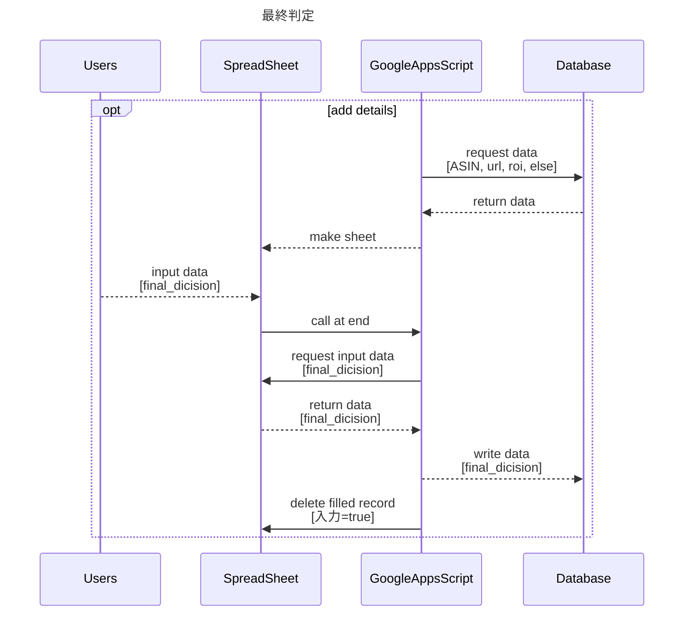

```mermaid
---
title: "最終判定"
---
sequenceDiagram
    participant users as Users
    participant ss as SpreadSheet
    participant gas as GoogleAppsScript
    participant db as Database

        opt add details    
        gas ->> db : request data<br/>[ASIN, url, roi, else]
        db -->> gas : return data
        gas -->> ss : make sheet
        users -->> ss : input data<br/>[final_dicision] 
        ss ->> gas : call at end
        gas ->> ss :  request input data<br/>[final_dicision]
        ss -->> gas : return data<br/>[final_dicision]
        gas -->> db : write data<br/>[final_dicision]
        gas ->> ss : delete filled record<br/>[入力=true]
        end

```
