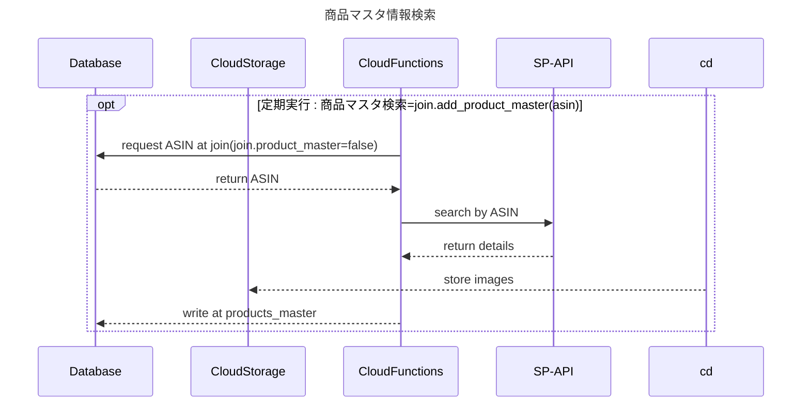

```mermaid
---
title: '商品マスタ情報検索'
---
sequenceDiagram
    participant db as Database
    participant cs as CloudStorage
    participant cf as CloudFunctions
    participant spapi as SP-API

        opt 定期実行 : 商品マスタ検索=join.add_product_master(asin)
            cf ->> db : request ASIN at join(join.product_master=false)
            db -->> cf : return ASIN
            cf ->> spapi : search by ASIN
            spapi -->> cf : return details
            cd -->> cs : store images
            cf -->> db : write at products_master
        end
```
