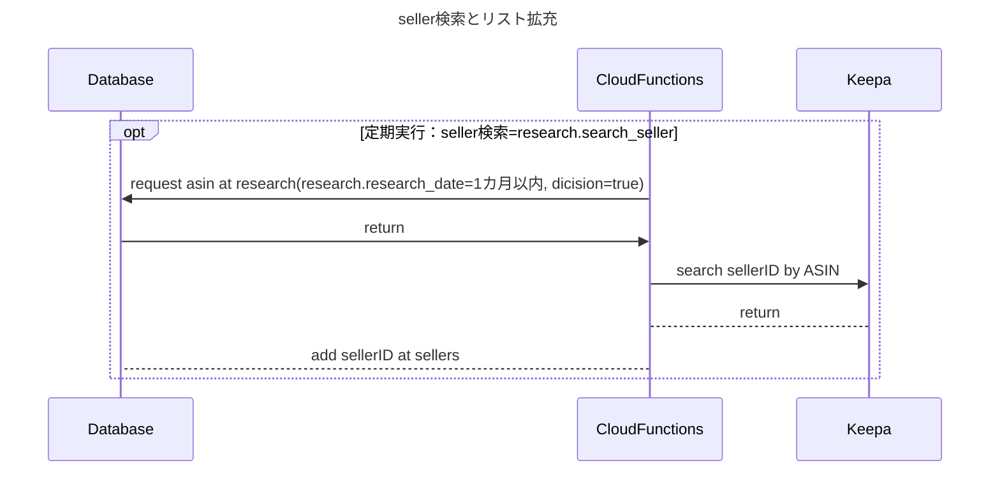

```mermaid
---
title: 'seller検索とリスト拡充'
---
sequenceDiagram
    participant db as Database
    participant cf as CloudFunctions
    participant keepa as Keepa

        opt 定期実行：seller検索=research.search_seller
            cf ->> db : request asin at research(research.research_date=1カ月以内, dicision=true)
            db ->> cf : return
            cf ->> keepa : search sellerID by ASIN
            keepa --> cf : return
            cf --> db : add sellerID at sellers
        end

```