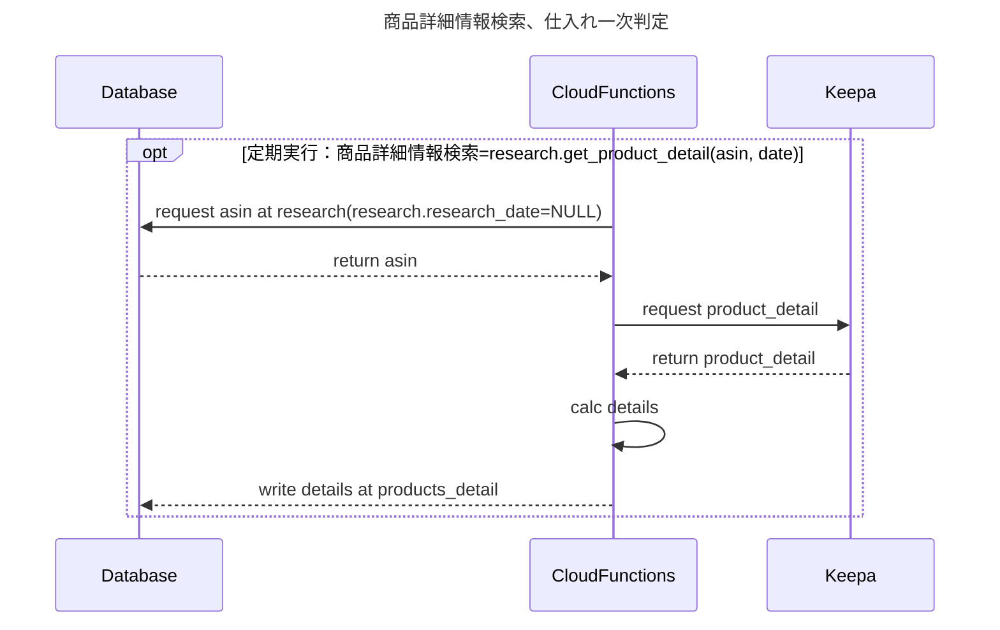

```mermaid
---
title: '商品詳細情報検索、仕入れ一次判定'
---
sequenceDiagram
    participant db as Database
    participant cf as CloudFunctions
    participant keepa as Keepa

        opt 定期実行：商品詳細情報検索=research.get_product_detail(asin, date)
            cf ->> db : request asin at research(research.research_date=NULL)
            db -->> cf : return asin
            cf ->> keepa : request product_detail
            keepa -->> cf : return product_detail
            cf ->> cf : calc details
            cf -->> db : write details at products_detail
        end
```