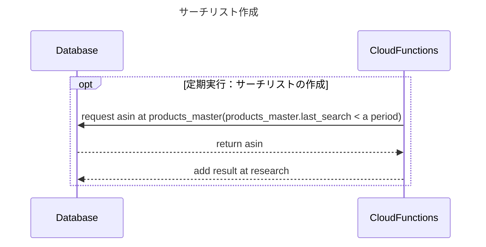

```mermaid
---
title: 'サーチリスト作成'
---
sequenceDiagram
    participant db as Database
    participant cf as CloudFunctions
    
        opt 定期実行：サーチリストの作成
            cf ->> db : request asin at products_master(products_master.last_search < a period)
            db -->> cf : return asin
            cf -->> db : add result at research
        end

```