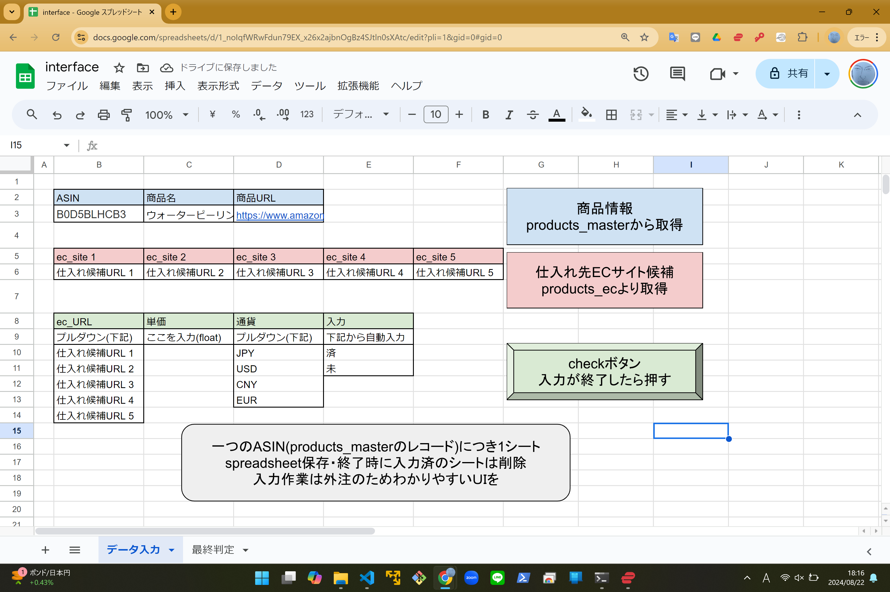
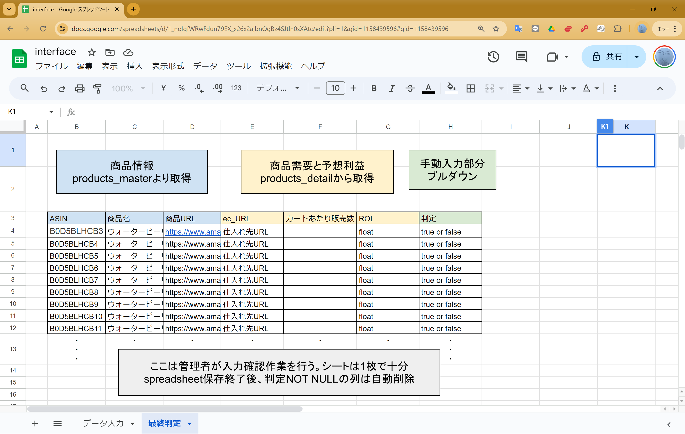

# 要件

## ツール開発の目的

FBAを利用した個人輸入業の仕入れ調査の効率化のため、amazon.co.jpで商品リサーチを自動化したい。

## 業務要件

既存のDBをもとに定期的に検索を行い、条件を満たす商品(Amazon.co.jpに出品されているもの)をリスト化する。
また、リストに対し人力で最終的な仕入れ判定を行い、その結果も記録する。

## システム要件(案)

cloud SQLにDBを構築し、cloud functionで定期実行しデータを収集する。画像データはcloud storage上に保存し、リンクをcloud SQLに保存する。
一部人力による入力が必要な部分についてはGASを利用してspreadsheet上で操作を行う。この人力による入力は外注とするため、操作が容易になるようUIをデザインしたい。

1. DBに登録されているsellerIDを引数に、cloud functionsとkeepaでsellerの出品しているASINを取得。中間テーブルを更新する。
1. DBに登録されているASINを引数に、cloud functionsとSP-APIを利用してASINに対応するURL, 重量等, 商品画像のマスタ情報を取得する。商品画像はcloud storageに保存する。
1. DBにある商品画像のURL(cloud storage)をもとにcloud storageに保存された商品画像を取得。これを引数にcloud functionsでcustom search apiを呼び出し、ヒットした検索結果上位5つをDBに保存する。
1. 商品マスタ情報で最終検索日時が一定期間より過去のものを選択し、cloud functionsでDB上のサーチリストに追加する。
1. サーチリスト上で検索が終了していないものを選択し、cloud functionsでkeepaを呼び出し、その商品の売れ行きなどを計算し、DBに追加する。
1. userがspreadsheetを利用してDBの情報(商品価格等)を更新する。
1. userがspreadsheetを利用してDBに登録された商品が仕入れてもよいものか最終判断を行い、結果を入力する。

## システム方式・構成
### シーケンス図
#### 1. ASINリスト取得
@import "./SQ/research_SQ_get_asin.md"

#### 2. 商品のマスタ情報を取得
@import "./SQ/research_SQ_get_details.md"

#### 3. 商品画像から仕入れ先候補を検索
@import "./SQ/research_SQ_image_search.md"

#### 4. サーチリストの作成
@import "./SQ/research_SQ_search_listing.md"

#### 5. 需要計算
@import "./SQ/research_SQ_keepa.md"

#### 6. Userによる商品のマスタ情報入力
@import "./SQ/research_SQ_UI_input_data.md"

#### 7. User(Admin)による仕入れの最終判断
@import "./SQ/research_SQ_UI_dicision.md"

### アーキテクチャー図
 
※使用言語はGAS/Python/MySQL

### ER図
@import "./research_ER.md"

### 手動入力部
#### 6. Userによる商品のマスタ情報入力

#### 7. User(Admin)による仕入れの最終判断

## 用語定義

* sellers table：FBAセラーのテーブル。各セラーIDから、出品している商品のASINを取得し中間テーブル(join table)に加えていくことで商品リストを拡大していく。

* join table：FBAセラーとASINの対応付けのための中間テーブル。sellers tableによってレコードが追加され、このjoin tableでASINを用いてproducts_master tableにレコードを追加していくことで商品リストを拡大していく。

* products_master：商品のリストおよびマスタ情報。join tableから新規にレコードを追加された場合、SP-apiなどを用いてマスタ情報を取得する。一部データ(購入先URL, 購入単価, 購入通貨)については人力で入力する。そのためにマスタ情報に含まれる商品画像を用いて画像検索をおこない、購入先の情報をproducts_ec tableへ追加する。

* products_ec table：各ASINに対応した仕入れ先ECサイトのURL。このURLから本当に商品が仕入れられるか、また価格はいくらで通貨は何かを確認する。確認したデータ(購入先URL, 購入単価, 購入通貨)は人力でproducts_master tableに追加していく。

* research table：実際の商品リサーチための中間テーブル。ASINと検索した日時をもとにproducts_detail tableへ商品情報を追加していく。最終的にproducts_detail tableに蓄積されたデータから仕入れ判定(=research.dicision)を行い、research tableに追加することでリサーチの結果を保持する。最終判定は人力で行う。

* products_detail table：商品の詳細な情報。keepaを用いてデータを収集し、利益絵率を計算し判定を行う。その過程で競合カートの情報を保持する。

* competitors table：ASINと検索日時に依存する競合カートのデータ。ここから月間カートあたりの出荷数を予想する。

* purchase table：research tableで最終判定trueとなったASIN。

--以下は今後拡張したい機能--

* deliver table：purchase tableから転送され、国内倉庫に到着した商品のテーブル。

* stock table：FBA倉庫に納品された商品のテーブル

* shipping table：売れた商品のテーブル

* analysis table：売上解析のためのテーブル

### Appendix
クラス図(案)
@import "./research_class.md"
