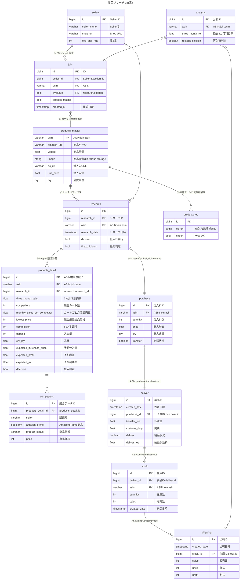

```mermaid

---
title: "商品リサーチDB(案)"
---
erDiagram
    sellers ||--o{ join : "① ASINリスト取得"
    join }o--|| products_master : "② 商品マスタ情報取得"
    research }o--|| sellers : ""
    products_master ||--o{ research : "④ サーチリスト作成"
    products_master ||--o{ products_ec : "③ 画像で仕入れ先候補検索"
    research ||--o{ products_detail : "⑤ keepaで需要計算"
    products_detail ||--o{ competitors : ""
    research ||--|| purchase : "asin:research.final_dicision=true"
    purchase ||--|| deliver : "ASIN:purchase.transfer=true"
    deliver ||--o{ stock : "ASIN:deliver.deliver=true"
    stock ||--o{ shipping :"ASIN:stock.shipping=true"
    analysis }o--o{ shipping : ""
    analysis }o--|| join :""


    sellers {
        bigint id PK "Seller ID"
        varchar seller_name "Seller名"
        varchar shop_url "Shop URL"
        int five_star_rate "星5率"
    }

    join {
        bigint id PK "ID"
        bigint seller_id FK "Seller ID:sellers.id"
        varchar asin FK "ASIN"
        bool evaluate FK "research.dicision"
        bool product_master
        timestamp created_at "作成日時"
    }

%% 検索時間に依存するdataを分離。productsとproducts_detailへ再編
    products_master { 
        varchar asin PK "ASIN:join.asin"
        varchar amazon_url "商品ページ"
        float weight "商品重量"
        string image "商品画像URL:cloud storage"
        varchar ec_url "購入先URL"
        float unit_price "購入単価"
        cry cry "通貨単位"
    }

    products_ec {
        bigint id PK
        string ec_url "仕入れ先候補URL"
        bool check "チェック"
    }

%% asinで一括検索する場合を考慮し、リサーチ日時とともに中間テーブル作成
    research {
        bigint id PK ""
        bigint research_id FK "リサーチID"
        varcher asin FK "ASIN:join.asin"
        timestamp research_date "リサーチ日時"
        bool dicision "仕入れ判定"
        bool final_dicision "最終判定"
    }

    products_detail {
        bigint id PK "ASIN検索履歴ID"
        varchar asin FK "ASIN:join.asin"
        bigint research_id FK "research.research_id"
        float three_month_sales "3カ月間販売数"
        int competitors "競合カート数"
        float monthly_sales_per_competitor "カートごと月間販売数"
        int lowest_price "競合最低出品価格"
        int commission "FBA手数料"
        int deposit "入金量"
        float cry_jpy "為替"
        float expected_purchase_price "予想仕入値"
        float expected_profit "予想利益"
        float expexted_roi "予想利益率"
        bool decision "仕入判定"
    }

%% 競合の情報をtableとして追加
    competitors {
        bigint id PK "競合データID"
        bigint products_detail_id FK "products_detail.id"
        varchar seller "販売元"
        boolearm amazon_prime "Amazom Prime商品"
        varchar product_status "商品状態"
        int price "出品価格"
    }

    purchase {
        bigint id PK "仕入れID"
        varchar asin FK "ASIN:join.asin"
        int quantity "仕入れ数"
        float price "購入単価"
        cry cry "購入通貨"
        boolean transfer "転送状況"
    }

    deliver {
        bigint id PK "納品ID"
        timestamp created_date "到着日時"
        bigint purchase_id FK "仕入れID:purchase.id"
        float transfer_fee "転送量"
        float customs_duty "関税"
        boolean deliver "納品状況"
        float deliver_fee "納品手数料"
    }

    stock {
        bigint id PK "在庫ID"
        bigint deliver_id FK "納品ID:deliver.id"
        varchar asin FK "ASIN:join.asin"
        int quantity "在庫数"
        int sales "販売数"
        timestamp created_date "納品日時"
    }

    shipping {
        bigint id PK "出荷ID"
        timestamp created_date "出荷日時"
        bigint stock_id FK "在庫ID:stock.id"
        int sales "販売数"
        int price "価格"
        int profit "利益"
    }

    analysis {
        bigint id PK "分析ID"
        varchar asin FK "ASIN:join.asin"
        float three_month_roi "過去3カ月利益率"
        boolean restock_dicision "再入荷判定"
    }


```