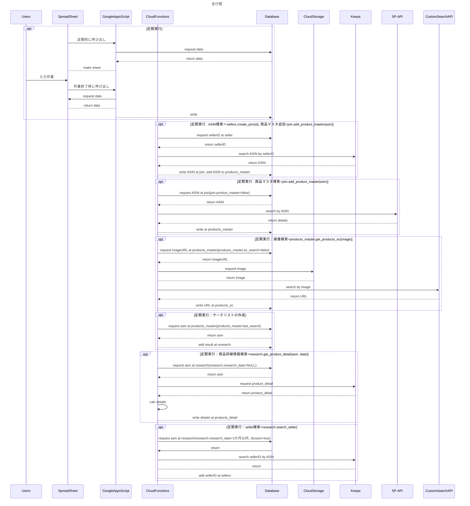

```mermaid
---
title: "全行程"
---
sequenceDiagram
    participant users as Users
    participant ss as SpreadSheet
    participant gas as GoogleAppsScript
    participant cf as CloudFunctions
    participant db as Database
    participant cs as CloudStorage
    participant keepa as Keepa
    participant spapi as SP-API
    participant csapi as CustomSearchAPI

        opt 定期実行    
        ss ->> gas : 定期的に呼び出し
        gas ->> db : request data
        db -->> gas : return data
        gas --> ss : make sheet
        users ->> ss : 入力作業
        ss ->> gas : 作業終了時に呼び出し
        gas ->> ss :  request data
        ss --> gas : return data
        gas -->> db : write
        end


        opt 定期実行 : ASIN検索＝sellers.create_join(id), 商品マスタ追加=join.add_product_master(asin)
            cf ->> db : request sellerID at seller
            db -->> cf : return sellerID
            cf ->> keepa : search ASIN by sellerID
            keepa -->> cf : return ASIN
            cf -->> db : write ASIN at join, add ASIN to products_master
        end

        opt 定期実行 : 商品マスタ検索=join.add_product_master(asin)
            cf ->> db : request ASIN at join(join.product_master=false)
            db -->> cf : return ASIN
            cf ->> spapi : search by ASIN
            spapi -->> cf : return details
            cf -->> db : write at products_master
        end

        opt 定期実行：画像検索=products_master.get_products_ec(image)
            cf ->> db : request imageURL at products_master(products_master.ec_search=false)
            db -->> cf : return imageURL
            cf ->> cs : request image
            cs --> cf : return image
            cf ->> csapi : search by image
            csapi -->> cf : return URL
            cf -->> db : write URL at products_ec
        end

        opt 定期実行：サーチリストの作成
            cf ->> db : request asin at products_master(products_master.last_search)
            db -->> cf : return asin
            cf -->> db : add result at research
        end

        opt 定期実行：商品詳細情報検索=research.get_product_detail(asin, date)
            cf ->> db : request asin at research(research.research_date=NULL)
            db -->> cf : return asin
            cf ->> keepa : request product_detail
            keepa -->> cf : return product_detail
            cf ->> cf : calc details
            cf --> db : write details at products_detail
        end

        opt 定期実行：seller検索=research.search_seller
            cf ->> db : request asin at research(research.research_date=1カ月以内, dicision=true)
            db ->> cf : return
            cf ->> keepa : search sellerID by ASIN
            keepa --> cf : return
            cf --> db : add sellerID at sellers
        end


```

