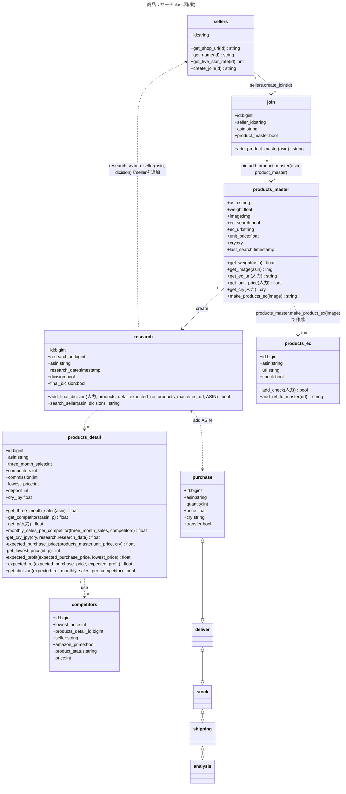

```mermaid

---
title: "商品リサーチclass図(案)"
---
classDiagram
direction TB

    sellers "1" ..> "n" join :　sellers.create_join(id)
    research  ..>  sellers : research.search_seller(asin, dicision)でsellerを追加
    join "n" ..> "1" products_master : join.add_product_master(asin, product_master)
    products_master "1" ..> "n"  research : create 
    products_master "1" ..> "5-10" products_ec : products_master.make_product_ex(image)で作成
    research "1" ..> "n" products_detail    
    products_detail "1" ..> "n" competitors : use
    research <..> purchase : add ASIN

    purchase <|--|> deliver
    deliver <|--|> stock
    stock <|--|> shipping
    shipping <|--|> analysis

%% sellerを管理するためのクラス。asinとの中間テーブルを作成
    class sellers {
        +id:string

        +get_shop_url(id) string
        +get_name(id) string
        +get_five_star_rate(id) int
        +create_join(id) string
    }

%% seller-masterの中間テーブル。masterのレコードを作成
    class join {
        +id:bigint
        +seller_id:string
        +asin:string
        +product_master:bool

        +add_product_master(asin) string        
    }

%% 商品情報マスタ
    class products_master {
        +asin:string
        +weight:float
        +image:img
        +ec_search:bool
        +ec_url:string
        +unit_price:float
        +cry:cry
        +last_search:timestamp

        +get_weight(asin) float
        +get_image(asin) img
        +get_ec_url(人力) string
        +get_unit_price(人力) float
        +get_cry(人力) cry
        +make_products_ec(image) string
    }

%% 仕入れ先候補のURL。商品画像からcustom search apiで生成
    class products_ec{
        +id:bigint
        +asin:string
        +url:string
        +check:bool

        +add_check(人力) bool
        +add_url_to_master(url):string
    }

%% リサーチテーブル。仕入れのスクリーニング結果からseller検索を行いsellerテーブルに追加する。
    class research {
        +id:bigint
        +research_id:bigint
        +asin:string
        +research_date:timestamp
        +dicision:bool
        +final_dicision:bool

        +add_final_dicision(人力, products_detail.expected_roi, products_master.ec_url, ASIN) bool
        +search_seller(asin, dicision) string
    }

%% リサーチ結果。この情報をもとにスクリーニング判定。
    class products_detail {
        +id:bigint
        +asin:string
        +three_month_sales:int
        +competitors:int
        +commission:int
        +lowest_price:int
        +deposit:int
        +cry_jpy:float

        +get_three_month_sales(asin) float
        +get_competitors(asin, p) float
        +get_p(人力) float
        +monthly_sales_per_competitor(three_month_sales, competitors) float
        -get_cry_jpy(cry, research.research_date) float
        -expected_purchase_price(products_master.unit_price, cry) float
        -get_lowest_price(id, p) int
        -expected_profit(expected_purchase_price, lowest_price) float
        +expected_roi(expected_purchase_price, expected_profit) float
        +get_dicision(expexted_roi, monthly_sales_per_competitor) bool
    }

%%　競合カートの情報。なくてもよいかも
    class competitors {
        +id:bigint
        +lowest_price:int
        +products_detail_id:bigint
        +seller:string
        +amazon_prime:bool
        +product_status:string
        +price:int
    }

%% 仕入れのテーブル。quantity=NULLのレコードは仕入れていないもの。

    class purchase {
        +id:bigint
        +asin:string
        +quantity:int
        +price:float
        +cry:string
        +transfer:bool
    }


```