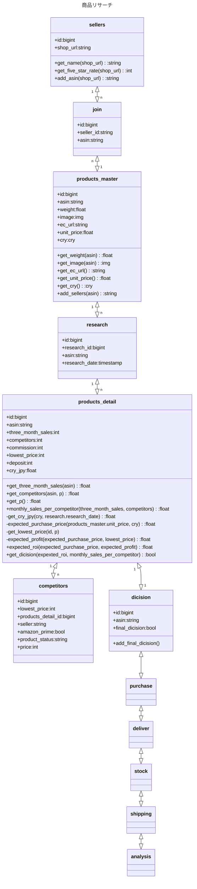

# 商品リサーチ管理DB

```mermaid

---
title: "商品リサーチ"
---
classDiagram
direction TB

    sellers "1" <|--|> "n" join
    join "n" <|--|> "1" products_master
    products_master "1" <|--|> "n"  research
    research "1" <|--|> "n" products_detail    
    products_detail "1" <|--|> "n" competitors
    products_detail "1" <|--|> "1" dicision

    dicision <|--|> purchase
    purchase <|--|> deliver
    deliver <|--|> stock
    stock <|--|> shipping
    shipping <|--|> analysis

    class sellers {
        +id:bigint
        +shop_url:string

        +get_name(shop_url):string
        +get_five_star_rate(shop_url):int
        +add_asin(shop_url):string
    }

    
    class join {
        +id:bigint
        +seller_id:string
        +asin:string        
    }

    class products_master {
        +id:bigint
        +asin:string
        +weight:float
        +image:img
        +ec_url:string
        +unit_price:float
        +cry:cry

        +get_weight(asin):float
        +get_image(asin):img
        +get_ec_url():string
        +get_unit_price():float
        +get_cry():cry
        +add_sellers(asin):string
    }

    class research {
        +id:bigint
        +research_id:bigint
        +asin:string
        +research_date:timestamp
    }

    class products_detail {
        +id:bigint
        +asin:string
        +three_month_sales:int
        +competitors:int
        +commission:int
        +lowest_price:int
        +deposit:int
        +cry_jpy:float
        +get_three_month_sales(asin):float
        +get_competitors(asin, p):float
        +get_p():float
        +monthly_sales_per_competitor(three_month_sales, competitors):float
        -get_cry_jpy(cry, research.research_date):float
        -expected_purchase_price(products_master.unit_price, cry):float
        -get_lowest_price(id, p)
        -expected_profit(expected_purchase_price, lowest_price):float
        +expected_roi(expected_purchase_price, expected_profit):float
        +get_dicision(expexted_roi, monthly_sales_per_competitor):bool
    }

    class competitors {
        +id:bigint
        +lowest_price:int
        +products_detail_id:bigint
        +seller:string
        +amazon_prime:bool
        +product_status:string
        +price:int
    }

    class dicision {
        +id:bigint
        +asin:string
        +final_dicision:bool

        +add_final_dicision()
    }

```